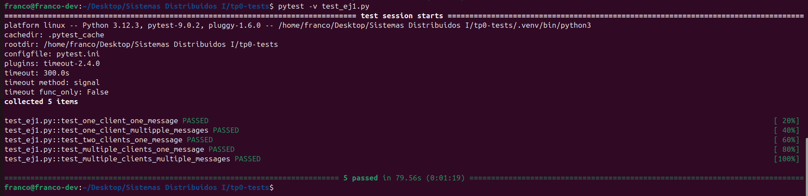
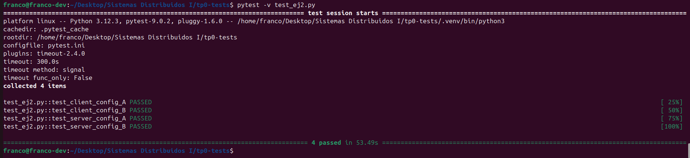
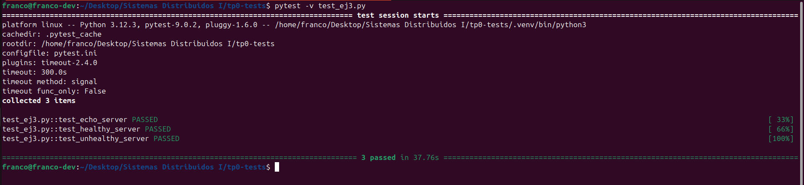
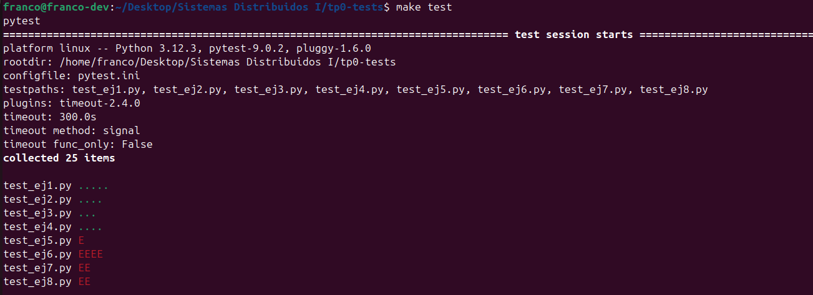
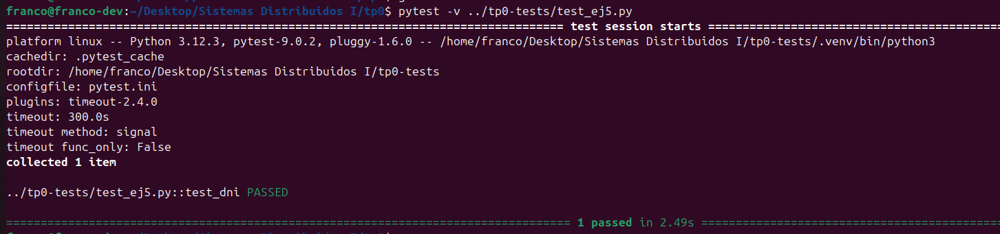
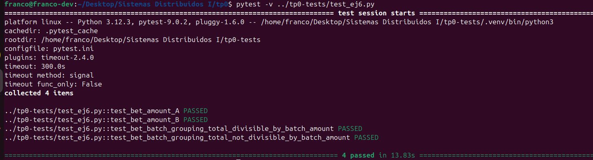
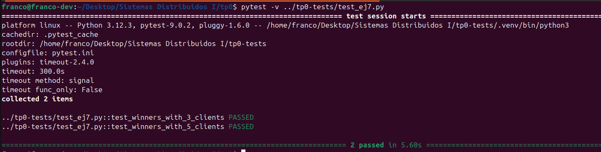
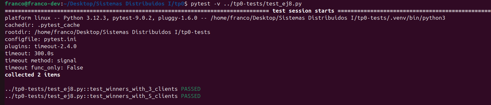

# TP0: Docker + Comunicaciones + Concurrencia

En el presente repositorio se provee un esqueleto básico de cliente/servidor, en donde todas las dependencias del mismo se encuentran encapsuladas en containers. Los alumnos deberán resolver una guía de ejercicios incrementales, teniendo en cuenta las condiciones de entrega descritas al final de este enunciado.

 El cliente (Golang) y el servidor (Python) fueron desarrollados en diferentes lenguajes simplemente para mostrar cómo dos lenguajes de programación pueden convivir en el mismo proyecto con la ayuda de containers, en este caso utilizando [Docker Compose](https://docs.docker.com/compose/).

## Instrucciones de uso
El repositorio cuenta con un **Makefile** que incluye distintos comandos en forma de targets. Los targets se ejecutan mediante la invocación de:  **make \<target\>**. Los target imprescindibles para iniciar y detener el sistema son **docker-compose-up** y **docker-compose-down**, siendo los restantes targets de utilidad para el proceso de depuración.

Los targets disponibles son:

| target  | accion  |
|---|---|
|  `docker-compose-up`  | Inicializa el ambiente de desarrollo. Construye las imágenes del cliente y el servidor, inicializa los recursos a utilizar (volúmenes, redes, etc) e inicia los propios containers. |
| `docker-compose-down`  | Ejecuta `docker-compose stop` para detener los containers asociados al compose y luego  `docker-compose down` para destruir todos los recursos asociados al proyecto que fueron inicializados. Se recomienda ejecutar este comando al finalizar cada ejecución para evitar que el disco de la máquina host se llene de versiones de desarrollo y recursos sin liberar. |
|  `docker-compose-logs` | Permite ver los logs actuales del proyecto. Acompañar con `grep` para lograr ver mensajes de una aplicación específica dentro del compose. |
| `docker-image`  | Construye las imágenes a ser utilizadas tanto en el servidor como en el cliente. Este target es utilizado por **docker-compose-up**, por lo cual se lo puede utilizar para probar nuevos cambios en las imágenes antes de arrancar el proyecto. |
| `build` | Compila la aplicación cliente para ejecución en el _host_ en lugar de en Docker. De este modo la compilación es mucho más veloz, pero requiere contar con todo el entorno de Golang y Python instalados en la máquina _host_. |

### Servidor

Se trata de un "echo server", en donde los mensajes recibidos por el cliente se responden inmediatamente y sin alterar. 

Se ejecutan en bucle las siguientes etapas:

1. Servidor acepta una nueva conexión.
2. Servidor recibe mensaje del cliente y procede a responder el mismo.
3. Servidor desconecta al cliente.
4. Servidor retorna al paso 1.


### Cliente
 se conecta reiteradas veces al servidor y envía mensajes de la siguiente forma:
 
1. Cliente se conecta al servidor.
2. Cliente genera mensaje incremental.
3. Cliente envía mensaje al servidor y espera mensaje de respuesta.
4. Servidor responde al mensaje.
5. Servidor desconecta al cliente.
6. Cliente verifica si aún debe enviar un mensaje y si es así, vuelve al paso 2.

### Ejemplo

Al ejecutar el comando `make docker-compose-up`  y luego  `make docker-compose-logs`, se observan los siguientes logs:

```
client1  | 2024-08-21 22:11:15 INFO     action: config | result: success | client_id: 1 | server_address: server:12345 | loop_amount: 5 | loop_period: 5s | log_level: DEBUG
client1  | 2024-08-21 22:11:15 INFO     action: receive_message | result: success | client_id: 1 | msg: [CLIENT 1] Message N°1
server   | 2024-08-21 22:11:14 DEBUG    action: config | result: success | port: 12345 | listen_backlog: 5 | logging_level: DEBUG
server   | 2024-08-21 22:11:14 INFO     action: accept_connections | result: in_progress
server   | 2024-08-21 22:11:15 INFO     action: accept_connections | result: success | ip: 172.25.125.3
server   | 2024-08-21 22:11:15 INFO     action: receive_message | result: success | ip: 172.25.125.3 | msg: [CLIENT 1] Message N°1
server   | 2024-08-21 22:11:15 INFO     action: accept_connections | result: in_progress
server   | 2024-08-21 22:11:20 INFO     action: accept_connections | result: success | ip: 172.25.125.3
server   | 2024-08-21 22:11:20 INFO     action: receive_message | result: success | ip: 172.25.125.3 | msg: [CLIENT 1] Message N°2
server   | 2024-08-21 22:11:20 INFO     action: accept_connections | result: in_progress
client1  | 2024-08-21 22:11:20 INFO     action: receive_message | result: success | client_id: 1 | msg: [CLIENT 1] Message N°2
server   | 2024-08-21 22:11:25 INFO     action: accept_connections | result: success | ip: 172.25.125.3
server   | 2024-08-21 22:11:25 INFO     action: receive_message | result: success | ip: 172.25.125.3 | msg: [CLIENT 1] Message N°3
client1  | 2024-08-21 22:11:25 INFO     action: receive_message | result: success | client_id: 1 | msg: [CLIENT 1] Message N°3
server   | 2024-08-21 22:11:25 INFO     action: accept_connections | result: in_progress
server   | 2024-08-21 22:11:30 INFO     action: accept_connections | result: success | ip: 172.25.125.3
server   | 2024-08-21 22:11:30 INFO     action: receive_message | result: success | ip: 172.25.125.3 | msg: [CLIENT 1] Message N°4
server   | 2024-08-21 22:11:30 INFO     action: accept_connections | result: in_progress
client1  | 2024-08-21 22:11:30 INFO     action: receive_message | result: success | client_id: 1 | msg: [CLIENT 1] Message N°4
server   | 2024-08-21 22:11:35 INFO     action: accept_connections | result: success | ip: 172.25.125.3
server   | 2024-08-21 22:11:35 INFO     action: receive_message | result: success | ip: 172.25.125.3 | msg: [CLIENT 1] Message N°5
client1  | 2024-08-21 22:11:35 INFO     action: receive_message | result: success | client_id: 1 | msg: [CLIENT 1] Message N°5
server   | 2024-08-21 22:11:35 INFO     action: accept_connections | result: in_progress
client1  | 2024-08-21 22:11:40 INFO     action: loop_finished | result: success | client_id: 1
client1 exited with code 0
```


## Parte 1: Introducción a Docker
En esta primera parte del trabajo práctico se plantean una serie de ejercicios que sirven para introducir las herramientas básicas de Docker que se utilizarán a lo largo de la materia. El entendimiento de las mismas será crucial para el desarrollo de los próximos TPs.

### Ejercicio N°1:
Definir un script de bash `generar-compose.sh` que permita crear una definición de Docker Compose con una cantidad configurable de clientes.  El nombre de los containers deberá seguir el formato propuesto: client1, client2, client3, etc. 

El script deberá ubicarse en la raíz del proyecto y recibirá por parámetro el nombre del archivo de salida y la cantidad de clientes esperados:

`./generar-compose.sh docker-compose-dev.yaml 5`

Considerar que en el contenido del script pueden invocar un subscript de Go o Python:

```
#!/bin/bash
echo "Nombre del archivo de salida: $1"
echo "Cantidad de clientes: $2"
python3 mi-generador.py $1 $2
```

En el archivo de Docker Compose de salida se pueden definir volúmenes, variables de entorno y redes con libertad, pero recordar actualizar este script cuando se modifiquen tales definiciones en los sucesivos ejercicios.

#### Resolución

Para la resolución del ejercicio se implementó un script que permite generar un archivo **Docker Compose** con una cantidad configurable de clientes.

##### Ejecución

Se provee el archivo `generar-compose.sh` en la raíz del proyecto.

El script recibe dos parámetros:

1. Nombre del archivo de salida
2. Cantidad de clientes a generar

Ejemplo de ejecución desde la raíz del proyecto:

```bash
./generar-compose.sh docker-compose-dev.yaml 5
```

En este ejemplo se genera un archivo `docker-compose-dev.yaml` con cinco servicios cliente (`client1` a `client5`).

---

##### Estructura del proyecto

La lógica de generación del archivo Docker Compose se implementó en Python dentro del directorio `tools`.

```
tools/
 ├─ generator.py
 ├─ common_writer.py
 ├─ server_writer.py
 ├─ clients_writer.py
 └─ networks_writer.py
```

###### Descripción de los módulos

- `generator.py`  
  Contiene el punto de entrada (`main`) del programa. Recibe los parámetros del script y coordina la generación del archivo.

- `common_writer.py`  
  Define estructuras comunes del archivo Docker Compose.

- `server_writer.py`  
  Contiene la definición del servicio `server`.

- `clients_writer.py`  
  Genera dinámicamente los servicios `client1`, `client2`, ..., `clientN`.

- `networks_writer.py`  
  Define la configuración de redes del entorno.

---

##### Flujo de generación

El archivo Docker Compose se genera en el siguiente orden:

1. Header del archivo (`name` y `services`)
2. Definición del servicio `server`
3. Generación de los clientes
4. Definición de la red

Esto permite generar automáticamente un archivo Compose válido con la cantidad de clientes especificada.

#### Test

Recomendado `sudo usermod -aG docker $USER` y `snewgrp docker`
Ejecutar test `pytest -v test_ej1.py`

##### Resultados de los tests



### Ejercicio N°2:
Modificar el cliente y el servidor para lograr que realizar cambios en el archivo de configuración no requiera reconstruír las imágenes de Docker para que los mismos sean efectivos. La configuración a través del archivo correspondiente (`config.ini` y `config.yaml`, dependiendo de la aplicación) debe ser inyectada en el container y persistida por fuera de la imagen (hint: `docker volumes`).

#### Resolución

Para la resolución del ejercicio se mantiene la misma estructura utilizada en el ejercicio N.º 1. La diferencia principal es que se agregan volúmenes (volumes) en Docker Compose para montar y persistir los archivos de configuración dentro de los contenedores.

De esta manera, los cambios en los archivos de configuración no requieren reconstruir (rebuild) las imágenes de Docker de cada servicio, sino únicamente reiniciar los contenedores para que los cambios tomen efecto.

Adicionalmente, para que los tests se ejecuten correctamente, se elimina el LOG_LEVEL hardcodeado en las clases responsables de generar el archivo docker-compose, permitiendo que dicho valor sea tomado desde los archivos de configuración montados mediante los volúmenes.

##### Resultados de los tests



##### Ejecución

Se provee el archivo `generar-compose.sh` en la raíz del proyecto.

El script recibe dos parámetros:

1. Nombre del archivo de salida
2. Cantidad de clientes a generar

Ejemplo de ejecución desde la raíz del proyecto:

```bash
./generar-compose.sh docker-compose-dev.yaml 5
```

En este ejemplo se genera un archivo `docker-compose-dev.yaml` con cinco servicios cliente (`client1` a `client5`).

---

##### Estructura del proyecto

La lógica de generación del archivo Docker Compose se implementó en Python dentro del directorio `tools`.

```
tools/
 ├─ generator.py
 ├─ common_writer.py
 ├─ server_writer.py
 ├─ clients_writer.py
 └─ networks_writer.py
```

### Ejercicio N°3:
Crear un script de bash `validar-echo-server.sh` que permita verificar el correcto funcionamiento del servidor utilizando el comando `netcat` para interactuar con el mismo. Dado que el servidor es un echo server, se debe enviar un mensaje al servidor y esperar recibir el mismo mensaje enviado.

En caso de que la validación sea exitosa imprimir: `action: test_echo_server | result: success`, de lo contrario imprimir:`action: test_echo_server | result: fail`.

El script deberá ubicarse en la raíz del proyecto. Netcat no debe ser instalado en la máquina _host_ y no se pueden exponer puertos del servidor para realizar la comunicación (hint: `docker network`). `

#### Resolución

##### Resultados de los tests



##### Ejecución

Se provee el archivo `validar-echo-server.sh` en la raíz del proyecto.

### Ejercicio N°4:
Modificar servidor y cliente para que ambos sistemas terminen de forma _graceful_ al recibir la signal SIGTERM. Terminar la aplicación de forma _graceful_ implica que todos los _file descriptors_ (entre los que se encuentran archivos, sockets, threads y procesos) deben cerrarse correctamente antes que el thread de la aplicación principal muera. Loguear mensajes en el cierre de cada recurso (hint: Verificar que hace el flag `-t` utilizado en el comando `docker compose down`).

#### Resolución

Para la resolución del ejercicio se implementa el cliente en python debido a una mayor afinidad con este lenguaje.

En este ejercicio se implementa el manejo correcto de señales del sistema operativo, en particular SIGTERM, para garantizar un apagado controlado (graceful shutdown) de los contenedores.

En el caso del cliente, se implementa un handler de señal que:

- Registra la recepción de SIGTERM
- Cierra cualquier conexión activa con el servidor
- Interrumpe el loop de ejecución
- Finaliza el proceso de forma controlada con código de salida exitoso

Para lograr esto, se introduce el flag interno `_shutting_down` que permite detener la ejecución en distintos puntos del flujo:

- Antes de iniciar una nueva iteración
- Durante la recepción de datos
- Durante el período de espera entre iteraciones

En el caso del servidor, se implementa un handler para la señal SIGTERM, el cual permite:

- Detener la aceptación de nuevas conexiones
- Cerrar el socket principal del servidor
- Finalizar todas las conexiones activas con los clientes
- Terminar la ejecución del proceso de forma ordenada

Para esto, el servidor mantiene una colección de sockets de clientes activos, lo que permite iterar sobre ellos y cerrarlos explícitamente al momento de recibir la señal.

Adicionalmente, se introduce el flag interno `_server_running` que permite interrumpir el loop principal de aceptación de conexiones. Esto evita que el servidor continúe bloqueado esperando nuevas conexiones (accept) luego de recibir la señal de terminación.

El cierre del socket principal provoca que cualquier operación bloqueante sobre el mismo (como accept) falle, permitiendo salir del loop de manera controlada.

De esta forma, se garantiza que:

- No queden conexiones abiertas
- No se produzcan errores inesperados por sockets colgantes
- El proceso finalice correctamente con código de salida exitoso

##### Resultados de los tests



## Parte 2: Repaso de Comunicaciones

Las secciones de repaso del trabajo práctico plantean un caso de uso denominado **Lotería Nacional**. Para la resolución de las mismas deberá utilizarse como base el código fuente provisto en la primera parte, con las modificaciones agregadas en el ejercicio 4.

### Ejercicio N°5:
Modificar la lógica de negocio tanto de los clientes como del servidor para nuestro nuevo caso de uso.

#### Cliente
Emulará a una _agencia de quiniela_ que participa del proyecto. Existen 5 agencias. Deberán recibir como variables de entorno los campos que representan la apuesta de una persona: nombre, apellido, DNI, nacimiento, numero apostado (en adelante 'número'). Ej.: `NOMBRE=Santiago Lionel`, `APELLIDO=Lorca`, `DOCUMENTO=30904465`, `NACIMIENTO=1999-03-17` y `NUMERO=7574` respectivamente.

Los campos deben enviarse al servidor para dejar registro de la apuesta. Al recibir la confirmación del servidor se debe imprimir por log: `action: apuesta_enviada | result: success | dni: ${DNI} | numero: ${NUMERO}`.


#### Servidor
Emulará a la _central de Lotería Nacional_. Deberá recibir los campos de la cada apuesta desde los clientes y almacenar la información mediante la función `store_bet(...)` para control futuro de ganadores. La función `store_bet(...)` es provista por la cátedra y no podrá ser modificada por el alumno.
Al persistir se debe imprimir por log: `action: apuesta_almacenada | result: success | dni: ${DNI} | numero: ${NUMERO}`.

#### Comunicación:
Se deberá implementar un módulo de comunicación entre el cliente y el servidor donde se maneje el envío y la recepción de los paquetes, el cual se espera que contemple:
* Definición de un protocolo para el envío de los mensajes.
* Serialización de los datos.
* Correcta separación de responsabilidades entre modelo de dominio y capa de comunicación.
* Correcto empleo de sockets, incluyendo manejo de errores y evitando los fenómenos conocidos como [_short read y short write_](https://cs61.seas.harvard.edu/site/2018/FileDescriptors/).

#### Resolución

Para este ejercicio se tomó la decisión de definir una entidad de dominio propia denominada `AgencyBet`, en lugar de reutilizar directamente la estructura `Bet` provista por la cátedra.

La motivación principal de esta decisión radica en que la definición de `Bet` se encuentra acoplada al servidor, mientras que en este diseño se considera que una apuesta debe ser una entidad conocida tanto por el cliente como por el servidor. Esto permite:

- Definir de forma explícita la estructura de la apuesta que viaja por el protocolo.
- Mantener consistencia entre lo que el cliente envía y lo que el servidor procesa.
- Desacoplar el modelo de dominio del detalle de implementación del servidor.

En este contexto, `AgencyBet` representa la apuesta en el dominio de la aplicación, y es la estructura utilizada tanto para la serialización en el cliente como para la deserialización en el servidor.

##### Adaptación a la función provista por la cátedra

Dado que la función `store_bets(...)` provista por la cátedra espera objetos del tipo `Bet`, se implementó un wrapper encargado de realizar la transformación desde `AgencyBet` hacia `Bet`.

Este wrapper permite:

- Respetar la interfaz exigida por la cátedra sin modificar su implementación.
- Mantener el modelo de dominio propio (`AgencyBet`) aislado de detalles externos.
- Centralizar la conversión en un único punto del sistema.

De esta forma, el flujo queda definido de la siguiente manera:

1. El cliente construye un `AgencyBet`.
2. El `AgencyBet` se serializa y se envía al servidor mediante el protocolo definido.
3. El servidor deserializa el mensaje nuevamente a `AgencyBet`.
4. El wrapper transforma el `AgencyBet` a `Bet`.
5. Se invoca `store_bets(...)` con el tipo esperado.

Este enfoque permite mantener una arquitectura más clara, donde el dominio es independiente del transporte y de las restricciones impuestas por componentes externos.

---

##### Estructura del proyecto

Se definió una estructura de carpetas orientada a separar claramente las responsabilidades entre dominio, protocolo de comunicación y utilidades de bajo nivel:

```
├── domain/
│ └── agency_bet.py
├── protocol/
│ ├── message.py
│ └── serializer.py
├── utils/
│ └── socket_utils.py
```


###### `domain/`

Contiene las entidades del dominio de la aplicación.

- `agency_bet.py`: define la clase `AgencyBet`, que representa una apuesta dentro del sistema.

Esta capa es completamente independiente del protocolo y de la comunicación por sockets. Su única responsabilidad es modelar los datos de negocio.

---

###### `protocol/`

Encapsula toda la lógica relacionada con la comunicación entre cliente y servidor.

- `message.py`: define la estructura del mensaje del protocolo (`Message`), incluyendo:
  - tipo de mensaje (`MessageType`)
  - payload
  - serialización (`to_bytes`)
  - deserialización desde socket (`from_socket`)

- `serializer.py`: contiene la lógica de serialización y deserialización del dominio:
  - `serialize_bet(...)`: transforma un `AgencyBet` en `bytes`
  - `deserialize_bet(...)`: reconstruye un `AgencyBet` a partir de `bytes`

Esta separación permite desacoplar:
- la estructura del mensaje (header + payload)
- del contenido del mensaje (la apuesta en sí)

---

###### `utils/`

Contiene utilidades de bajo nivel relacionadas con el manejo de sockets.

- `socket_utils.py`: implementa funciones auxiliares como `recv_exact(...)`, que garantiza la lectura completa de bytes desde el socket, evitando problemas de *short read* propios de TCP.

Esta capa no conoce el dominio ni el protocolo, solo se encarga de operaciones básicas de transporte.

---

##### Protocolo de comunicación

Se implementó un protocolo simple para el intercambio de mensajes entre cliente y servidor.

###### Estructura del mensaje

Cada mensaje está compuesto por:

[TYPE][LENGTH][PAYLOAD]
1B 2B N bytes

- **TYPE (1 byte):** identifica el tipo de mensaje
  - `BET` (1): envío de apuesta
  - `ACK` (2): confirmación del servidor
  - `ERROR` (3): mensaje de error

- **LENGTH (2 bytes):** tamaño del payload en bytes, codificado en *big-endian*

- **PAYLOAD (N bytes):** contenido del mensaje

---

###### Serialización del payload

El payload de una apuesta (`AgencyBet`) se serializa como un string delimitado por `|`, luego codificado en UTF-8. Por ejemplo:

`Franco|Gomez|30904465|1999-03-17|7574`

---

##### Flujo de comunicación

El intercambio entre cliente y servidor sigue los siguientes pasos:

1. El cliente construye un `AgencyBet`.
2. El `AgencyBet` se serializa a bytes.
3. Se construye un `Message` de tipo `BET` con ese payload.
4. El cliente envía el mensaje al servidor.
5. El servidor:
   - recibe el mensaje
   - deserializa el payload a `AgencyBet`
   - almacena la apuesta
6. El servidor responde con un mensaje `ACK`.
7. El cliente recibe el `ACK`, lo deserializa y registra el resultado por log.

---

##### Manejo de TCP

Dado que TCP no garantiza la lectura completa en una sola operación, se implementó:

- `recv_exact(...)`: asegura la lectura de la cantidad exacta de bytes necesarios para reconstruir el mensaje completo (header + payload)

Esto evita problemas de:
- *short read*
- lectura parcial de mensajes

---

##### Conclusión

El diseño separa claramente:

- **Dominio (`domain/`)** → qué es una apuesta  
- **Protocolo (`protocol/`)** → cómo se representa y transmite  
- **Transporte (`utils/`)** → cómo se envían y reciben bytes  

Lo cual permite una solución modular, extensible y desacoplada.


##### Resultados de los tests




### Ejercicio N°6:
Modificar los clientes para que envíen varias apuestas a la vez (modalidad conocida como procesamiento por _chunks_ o _batchs_). 
Los _batchs_ permiten que el cliente registre varias apuestas en una misma consulta, acortando tiempos de transmisión y procesamiento.

La información de cada agencia será simulada por la ingesta de su archivo numerado correspondiente, provisto por la cátedra dentro de `.data/datasets.zip`.
Los archivos deberán ser inyectados en los containers correspondientes y persistido por fuera de la imagen (hint: `docker volumes`), manteniendo la convencion de que el cliente N utilizara el archivo de apuestas `.data/agency-{N}.csv` .

En el servidor, si todas las apuestas del *batch* fueron procesadas correctamente, imprimir por log: `action: apuesta_recibida | result: success | cantidad: ${CANTIDAD_DE_APUESTAS}`. En caso de detectar un error con alguna de las apuestas, debe responder con un código de error a elección e imprimir: `action: apuesta_recibida | result: fail | cantidad: ${CANTIDAD_DE_APUESTAS}`.

La cantidad máxima de apuestas dentro de cada _batch_ debe ser configurable desde config.yaml. Respetar la clave `batch: maxAmount`, pero modificar el valor por defecto de modo tal que los paquetes no excedan los 8kB. 

Por su parte, el servidor deberá responder con éxito solamente si todas las apuestas del _batch_ fueron procesadas correctamente.

#### Resolución

En este ejercicio se modificó la arquitectura cliente-servidor para soportar el envío de múltiples apuestas en un mismo mensaje (batch), reduciendo la cantidad de comunicaciones y mejorando la eficiencia.

Se adoptó un enfoque donde **todas las apuestas se envían utilizando el mismo formato de mensaje**, independientemente de si el batch contiene una o varias apuestas.

---

##### Cambios principales

###### Unificación del formato de mensaje

Se decidió reutilizar el mensaje de tipo `BET`, redefiniéndolo conceptualmente como una **colección de apuestas** en lugar de una única apuesta. De esta manera, se unifica el protocolo para todos los casos, incluyendo el envío de una sola apuesta.

Esto implica que todo mensaje `BET` contiene:

- `payload_len`: tamaño total del payload
- `payload_count`: cantidad de apuestas incluidas en el mensaje
- una lista de sub-payloads, donde cada uno representa una apuesta

Formato del mensaje:
`[type][payload_len][payload_count][payload_1_len][payload_1]...`


Esto permite simplificar el protocolo, evitando la necesidad de definir múltiples tipos de mensajes (por ejemplo, `BET` vs `BET_BATCH`) y manteniendo una única estructura consistente.

*Caso particular*: cuando se envía una sola apuesta, `payload_count = 1`, manteniendo exactamente el mismo formato.

---

###### Serialización y deserialización

Se adaptaron las funciones de serialización y deserialización para soportar múltiples apuestas dentro de un mismo mensaje.

Cada apuesta se serializa de forma individual y se encapsula como un sub-payload. En el servidor, los payloads son iterados y deserializados uno a uno para reconstruir las instancias de `AgencyBet`.

---

###### Origen de las apuestas

Cada cliente obtiene las apuestas a partir de su archivo correspondiente:

`.data/agency-{N}.csv`


Estos archivos no contienen encabezado, por lo que se utiliza `csv.reader` para procesarlos, transformando cada fila en una instancia de `AgencyBet`.

El path al archivo se define mediante la variable de entorno `BATCH_FILE`.

Esto permite desacoplar la configuración del cliente del código y facilita el uso de volúmenes en Docker.

---

###### Validación de tamaño del mensaje

Se incorporó una validación explícita del tamaño total del mensaje antes de su envío, para asegurar el cumplimiento de la restricción del enunciado que establece que los paquetes no deben exceder los **8kB**.

Para ello se diferencian dos límites:

- `MAX_SIZE = 65535`: límite técnico impuesto por el uso de campos de longitud de 2 bytes
- `MAX_PACKET_SIZE = 8192`: límite funcional requerido por el ejercicio

La validación se realiza al serializar el mensaje:

```python
if self.payload_len > MAX_SIZE:
    raise ValueError("Payload exceeds protocol limit")

if HEADER_BYTES + self.payload_len > MAX_PACKET_SIZE:
    raise ValueError("Payload exceeds 8KB limit")
```

De esta manera, se controla tanto que el payload pueda representarse correctamente dentro del protocolo como que el tamaño total transmitido no supere los 8kB.

---

###### Configuración

Se migró la lectura de configuración del cliente a `config.yaml`, alineándose con lo especificado en el enunciado.

Inicialmente, durante la conversión de Go a Python, la configuración se encontraba en formato `config.ini`. Sin embargo, los tests del ejercicio utilizan y modifican archivos en formato YAML, por lo que fue necesario adaptar la implementación para leer correctamente desde `config.yaml`.

En particular, el valor:
```
batch:
  maxAmount: 99
```

define la cantidad máxima de apuestas por batch.

---

###### Descompresión de datasets

Los archivos de apuestas son provistos comprimidos en `.data/dataset.zip`.

Se implementó la función `ensure_datasets` dentro de `/tools/generator.py`, la cual se encarga de descomprimir automáticamente el dataset en caso de que los archivos `.csv` no estén presentes.

Esta función es invocada al generar el `docker-compose-dev.yaml`, evitando la necesidad de intervención manual.

---

###### Uso de volúmenes

Cada cliente monta mediante Docker un volumen con su archivo de apuestas correspondiente.

Esto permite:

- persistir los datos fuera de la imagen
- evitar reconstrucciones innecesarias
- aislar correctamente la información de cada cliente (`agency-{N}.csv`)
- facilitar la ejecución de tests dinámicos

##### Resultados de los tests



### Ejercicio N°7:

Modificar los clientes para que notifiquen al servidor al finalizar con el envío de todas las apuestas y así proceder con el sorteo.
Inmediatamente después de la notificacion, los clientes consultarán la lista de ganadores del sorteo correspondientes a su agencia.
Una vez el cliente obtenga los resultados, deberá imprimir por log: `action: consulta_ganadores | result: success | cant_ganadores: ${CANT}`.

El servidor deberá esperar la notificación de las 5 agencias para considerar que se realizó el sorteo e imprimir por log: `action: sorteo | result: success`.
Luego de este evento, podrá verificar cada apuesta con las funciones `load_bets(...)` y `has_won(...)` y retornar los DNI de los ganadores de la agencia en cuestión. Antes del sorteo no se podrán responder consultas por la lista de ganadores con información parcial.

Las funciones `load_bets(...)` y `has_won(...)` son provistas por la cátedra y no podrán ser modificadas por el alumno.

No es correcto realizar un broadcast de todos los ganadores hacia todas las agencias, se espera que se informen los DNIs ganadores que correspondan a cada una de ellas.

#### Resolución

##### Servidor

| Método | Tipo | Descripción |
|-------|------|------------|
| `__init__` | Public | Inicializa el socket del servidor, las estructuras compartidas de clientes/agencias, los flags del sorteo (`_draw_started`, `_draw_done`) y los mecanismos de sincronización (`Lock` y `Condition`). |
| `run` | Public | Loop principal del servidor. Acepta conexiones entrantes y crea un thread daemon por cliente para procesar mensajes en paralelo. |
| `__accept_new_connection` | Private | Bloquea hasta aceptar una nueva conexión, registra el evento en logs y devuelve el socket del cliente. |
| `__add_client` | Private | Registra un cliente nuevo y lo marca inicialmente como `NOT_FINISH`. |
| `__remove_client` | Private | Elimina un cliente de las estructuras internas del servidor (`_client_sockets`, `_client_status`, `_agency_by_client`). |
| `__close_all_clients` | Private | Cierra todos los sockets de clientes activos y limpia su estado asociado. |
| `__close_server` | Private | Cierra el socket del servidor y detiene el loop principal de aceptación de conexiones. |
| `__handle_signal` | Private | Atiende `SIGTERM` y ejecuta un shutdown ordenado del servidor y de los clientes conectados. |
| `__handle_client_connection` | Private | Maneja el ciclo de vida completo de una conexión cliente: recibe mensajes y delega en handlers según el tipo (`BET`, `FINISH_BETS`, `GET_WINNERS`). |
| `__handle_bet` | Private | Deserializa apuestas, vincula el socket con su agencia, persiste las apuestas y responde con `ACK`. |
| `__bind_agency_id` | Private | Asocia un `client_sock` con su `agency_id` si todavía no estaba registrado. |
| `__handle_finish_bets` | Private | Marca que una agencia terminó de enviar apuestas. Si todas finalizaron y el sorteo aún no comenzó, reserva su ejecución, corre el sorteo una única vez, publica los resultados y notifica a los threads en espera. |
| `__handle_get_winners` | Private | Bloquea el thread del cliente hasta que el sorteo esté completamente listo y luego responde solo con los ganadores de la agencia asociada al socket. |
| `__run_draw` | Private | Carga todas las apuestas persistidas, identifica las ganadoras y arma una estructura `agency -> lista de DNIs ganadores`, que luego será publicada por el handler de finalización. |

##### Estrategia de sincronización

| Recurso | Tipo | Uso | Qué protege / coordina | Comportamiento |
|--------|------|-----|-------------------------|---------------|
| `_state_lock` | `Lock` | Exclusión mutua | `_client_sockets`, `_client_status`, `_agency_by_client` | Evita condiciones de carrera al modificar estructuras compartidas de clientes y agencias. |
| `_draw_condition` | `Condition` (sobre `_state_lock`) | Coordinación entre threads | `_draw_started`, `_draw_done`, `_winners_by_agency` | Permite que los threads de `GET_WINNERS` esperen hasta que el sorteo termine completamente. |
| `_draw_started` | Flag compartido | Reserva de ejecución | Inicio del sorteo | Garantiza que solo un thread ejecute `__run_draw()`. |
| `_draw_done` | Flag compartido | Publicación de disponibilidad | Estado final del sorteo | Indica que los resultados ya fueron calculados y publicados, por lo que los clientes pueden recibir respuesta. |
| `with _state_lock` | Bloque crítico | Lectura/escritura atómica | Estado compartido general | Asegura consistencia en accesos a estructuras internas. |
| `with _draw_condition` | Bloque crítico + sincronización | Espera y publicación del sorteo | Estado del draw | Usa el mismo lock para proteger el estado y coordinar `wait/notify`. |
| `_draw_condition.wait()` | Espera bloqueante | En `GET_WINNERS` | `_draw_done` | El thread libera el lock y queda dormido hasta que el sorteo termine. |
| `_draw_condition.notify_all()` | Señalización | Luego de publicar resultados | Threads esperando ganadores | Despierta a todos los clientes que estaban esperando respuesta. |

---

###### Resumen

- **`_state_lock`** protege las estructuras compartidas del servidor.
- **`_draw_condition`** coordina el evento global “el sorteo terminó”.
- **`_draw_started`** evita que más de un thread ejecute el sorteo.
- **`_draw_done`** indica que los resultados ya están listos para responder consultas.

---

##### Cliente

| Método | Tipo | Descripción |
|-------|------|------------|
| `__init__` | Public | Inicializa el cliente con su configuración, estado interno y handler de señales (`SIGTERM`). |
| `__create_client_socket` | Private | Crea la conexión TCP con el servidor usando la dirección configurada. Loguea error si falla. |
| `__handle_signal` | Private | Maneja `SIGTERM`, marca el cliente como en shutdown y cierra la conexión activa. |
| `start_client_loop` | Public | Flujo principal del cliente: conecta al servidor, envía apuestas en batches, espera respuestas, notifica finalización y consulta ganadores. |
| `__build_batches` | Private | Construye mensajes `BET` agrupando apuestas en batches de tamaño máximo configurado. |
| `__iter_agency_bets` | Private | Itera sobre el archivo CSV de entrada y genera objetos `AgencyBet`. |
| `__send_batch` | Private | Envía un mensaje `BET` al servidor serializado en bytes. |
| `__recv_result` | Private | Recibe y deserializa un mensaje desde el servidor. |
| `__notify_without_payload` | Private | Envía mensajes sin payload (`FINISH_BETS`, `GET_WINNERS`) incluyendo el `agency_id`. |
| `__log_result` | Private | Loguea el resultado de envío de un batch (`ACK`, `ERROR`, etc.). |
| `__log_winners_result` | Private | Loguea la cantidad de ganadores recibidos desde el servidor. |

---

###### Flujo del cliente

1. Se establece conexión con el servidor.
2. Se leen las apuestas desde archivo (`CSV`).
3. Se agrupan en batches (`BET`) y se envían secuencialmente.
4. Por cada batch se espera un `ACK` o `ERROR`.
5. Se envía `FINISH_BETS` indicando fin de envío.
6. Se envía `GET_WINNERS`.
7. El cliente queda bloqueado hasta recibir los resultados.
8. Se loguea la cantidad de ganadores y se cierra la conexión.

---

#### Resultados de los test



---

## Parte 3: Repaso de Concurrencia
En este ejercicio es importante considerar los mecanismos de sincronización a utilizar para el correcto funcionamiento de la persistencia.

### Ejercicio N°8:

Modificar el servidor para que permita aceptar conexiones y procesar mensajes en paralelo. En caso de que el alumno implemente el servidor en Python utilizando _multithreading_,  deberán tenerse en cuenta las [limitaciones propias del lenguaje](https://wiki.python.org/moin/GlobalInterpreterLock).

## Condiciones de Entrega
Se espera que los alumnos realicen un _fork_ del presente repositorio para el desarrollo de los ejercicios y que aprovechen el esqueleto provisto tanto (o tan poco) como consideren necesario.

Cada ejercicio deberá resolverse en una rama independiente con nombres siguiendo el formato `ej${Nro de ejercicio}`. Se permite agregar commits en cualquier órden, así como crear una rama a partir de otra, pero al momento de la entrega deberán existir 8 ramas llamadas: ej1, ej2, ..., ej7, ej8.
 (hint: verificar listado de ramas y últimos commits con `git ls-remote`)

Se espera que se redacte una sección del README en donde se indique cómo ejecutar cada ejercicio y se detallen los aspectos más importantes de la solución provista, como ser el protocolo de comunicación implementado (Parte 2) y los mecanismos de sincronización utilizados (Parte 3).

Se proveen [pruebas automáticas](https://github.com/7574-sistemas-distribuidos/tp0-tests) de caja negra. Se exige que la resolución de los ejercicios pase tales pruebas, o en su defecto que las discrepancias sean justificadas y discutidas con los docentes antes del día de la entrega. 

El incumplimiento de las pruebas es condición de desaprobación, pero su cumplimiento no es suficiente para la aprobación.  Se pide a los alumnos leer atentamente y **tener en cuenta** los criterios de corrección informados  [en el campus](https://campusgrado.fi.uba.ar/mod/page/view.php?id=73393).
Respetar el formato y contenido las entradas de logs descritas en los ejercicios, pues son las que se chequean en cada uno de los tests.

#### Resolución

Escenario contemplado en el Ejercicio N°7.

##### Resultados de los tests

